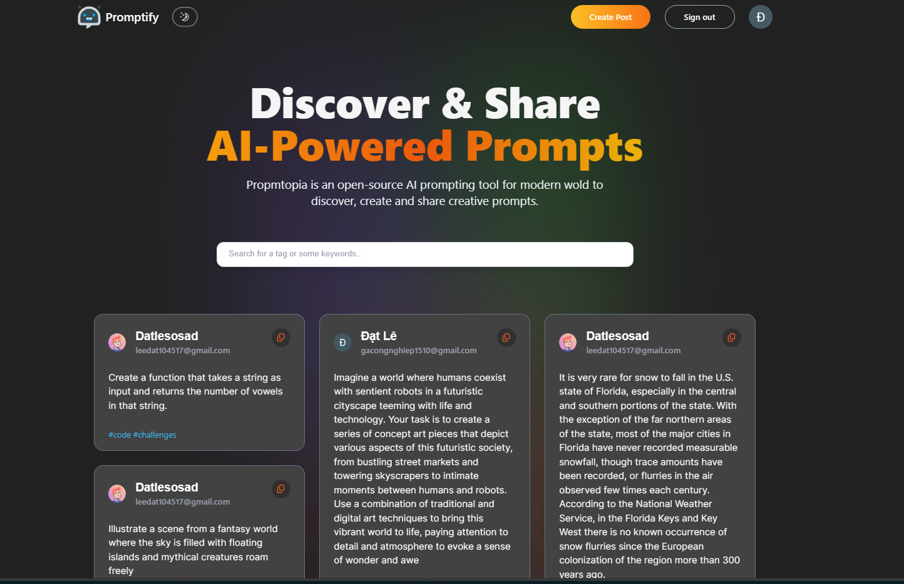
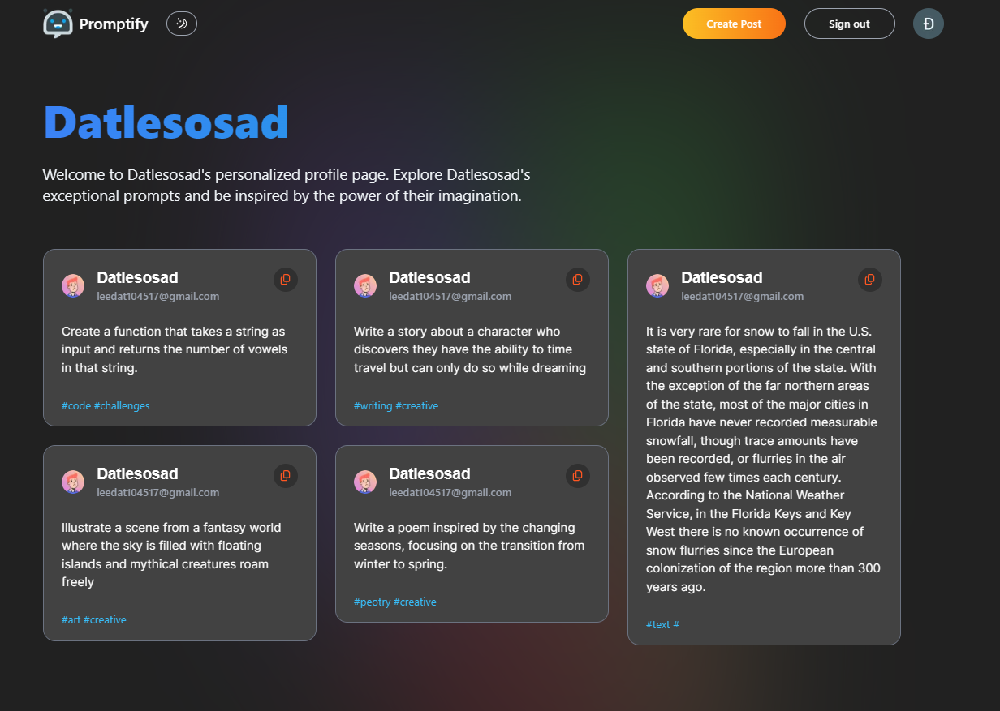
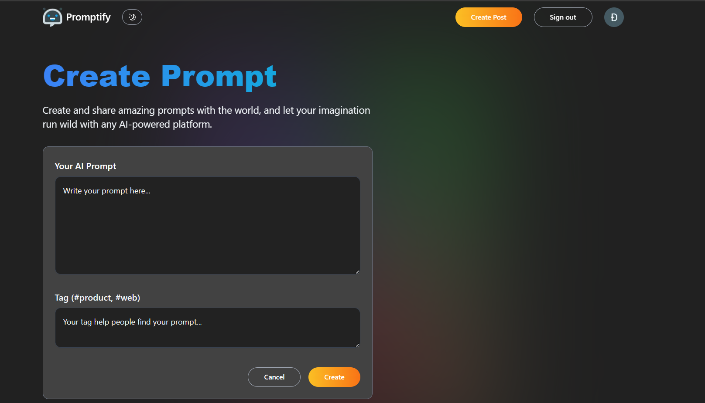

#  PROMPTIFY - AI SHARING PROMPT

Welcome to Promptify, an application that allows users to store and share AI-generated prompts with everyone! Whether you're a writer seeking inspiration, a coder looking for coding challenges, or simply someone who enjoys creative prompts, AI Prompt Hub has you covered.

## ✨ Features

- **Store and Share:** Store your favorite AI-generated prompts and share them with the community.
- **Discover New Prompts:** Explore a vast collection of creative prompts generated by AI.
- **Personalization:** Customize your experience by saving prompts to your profile and following your favorite contributors.
- **Next.js Frontend:** Utilizes the Next.js framework for a fast and responsive user interface.
- **MongoDB Database:** Store prompt data securely using MongoDB, ensuring scalability and reliability.
- **NextAuth.js:** Implement user authentication with NextAuth.js, allowing users to sign in securely with various providers.
- **Shadcn Integration:** Integrate with Shadcn for enhanced prompt generation capabilities and quality assurance.

## ⚙️ Tech Stack

- **Next.js:** Framework for building user interfaces with React.js.
- **MongoDB:** NoSQL database for storing prompt data securely.
- **NextAuth.js:** Library for implementing user authentication in Next.js applications.
- **Shadcn:** Integration for enhanced prompt generation capabilities using AI.

## 💻 Demo live app





## Getting Started

To get started with AI Prompt Hub, follow these steps:

1. Clone the repository:

```bash
  git clone https://github.com/your-username/ai-prompt-hub.git
```

Navigate to the project directory:

```bash
  cd ai-prompt-hub
```

Install dependencies:

```bash
  npm install
```

Set up environment variables:

- Create a .env.local file in the root directory.
- Add environment variables for MongoDB connection string, Shadcn API key, and any other required variables.

Start the development server:

```bash
  npm install
```

Open your browser and visit http://localhost:3000 to view the app.
